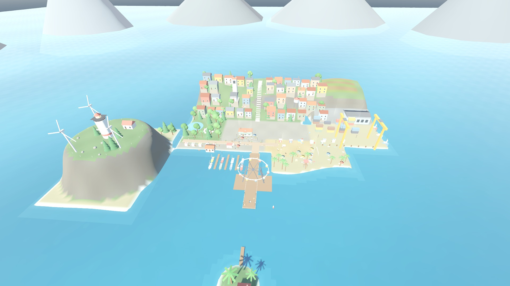
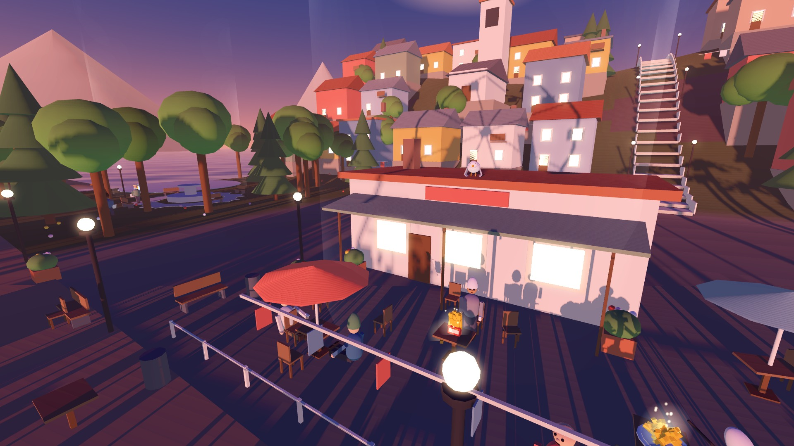
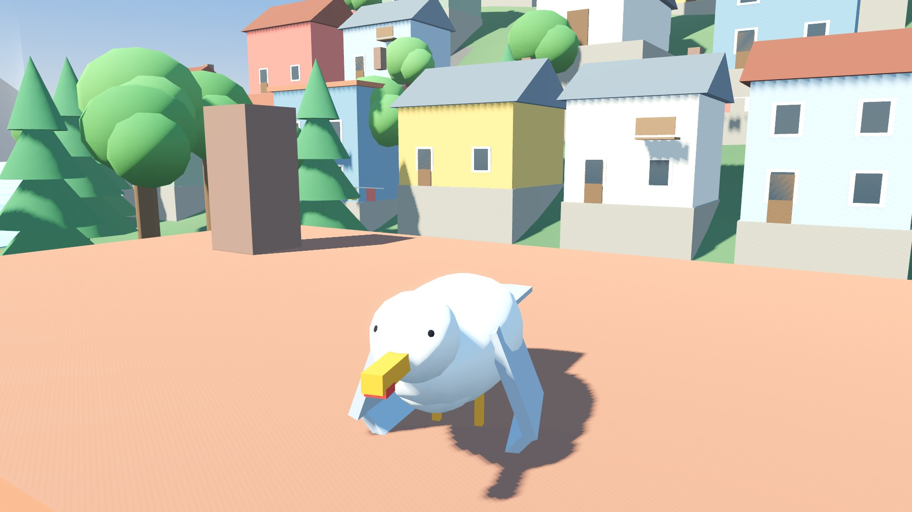
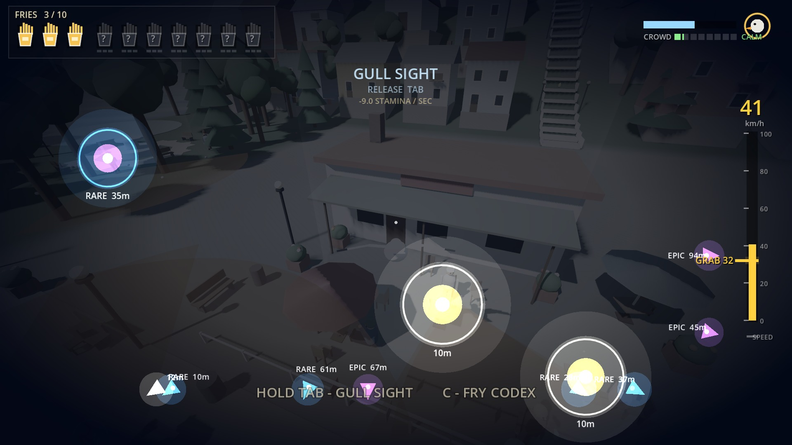
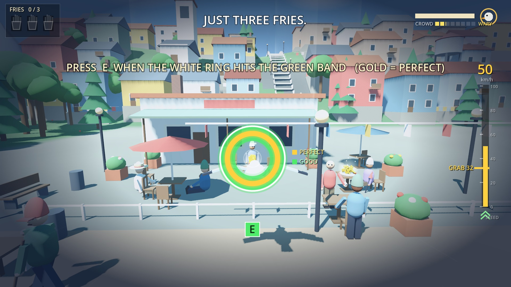
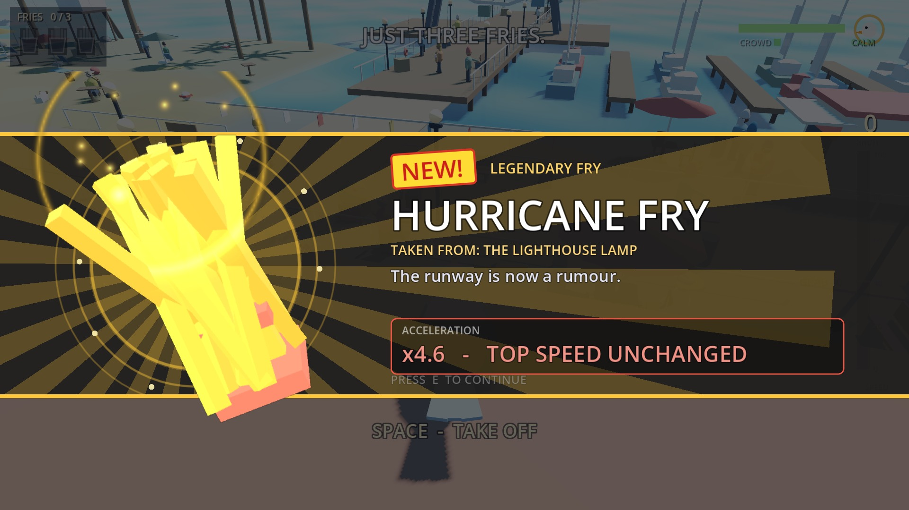
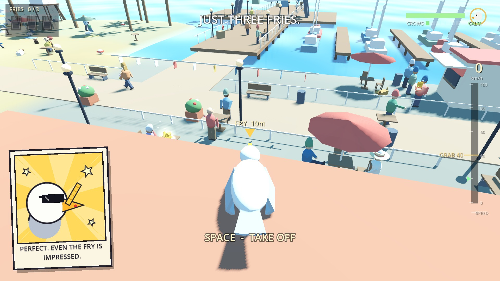
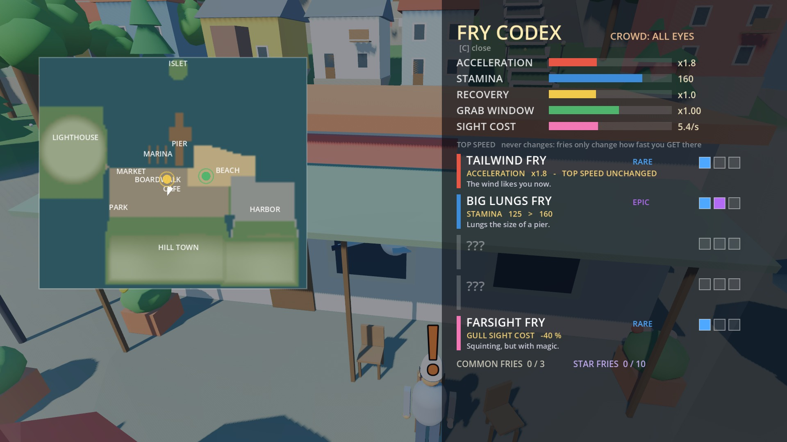

# JUST SOME FRIES

## ▶ Walkthrough video (3 min)

https://github.com/user-attachments/assets/c3f35bd6-2460-469f-bcd2-b76cdf8fe108

**[▶ Watch the walkthrough in your browser](https://kouhoukou.github.io/JUST-SOME-FRIES/walkthrough.html)** · [direct .mp4](https://kouhoukou.github.io/JUST-SOME-FRIES/walkthrough.mp4) · **[▶ Play the game in your browser](https://kouhoukou.github.io/JUST-SOME-FRIES/)**

---

> Be a gull. Steal magic fries off a seaside pier, and find out what you were really hungry for.

A small 3D flight game made for **Tripothon**, theme *"A Gift for ____"*.

**A gift for: the part of you that only wanted some fries.**

## ▶ Watch · Play · Download

| | Link |
|---|---|
| **Walkthrough video** (3 min, plays in the browser) | **[▶ Watch the walkthrough](https://kouhoukou.github.io/JUST-SOME-FRIES/walkthrough.html)** · [direct .mp4](https://kouhoukou.github.io/JUST-SOME-FRIES/walkthrough.mp4) |
| **Play in the browser** (no install) | **[kouhoukou.github.io/JUST-SOME-FRIES](https://kouhoukou.github.io/JUST-SOME-FRIES/)** |
| **Download for Windows** (the full experience) | **[Releases → JustSomeFries_Windows.zip](https://github.com/KOUHOUKOU/JUST-SOME-FRIES/releases/latest)** · [direct download](https://github.com/KOUHOUKOU/JUST-SOME-FRIES/releases/download/version1/JustSomeFries_Windows.zip) |
| Source (Godot 4 project) | [`game/`](game/) in this repository |

The walkthrough was recorded straight from the game with Godot's Movie Maker. A test bot flies it, so each dive starts with a cut. It shows the opening, the three tutorial fries (one ends with the gull shot down), Gull Sight, silver, gold and diamond fries, a stolen hat, the volleyball players and **the ending (spoilers)**.

## How to play

**Windows:** download the zip from [Releases](https://github.com/KOUHOUKOU/JUST-SOME-FRIES/releases/latest), unzip it and double-click `JustSomeFries.exe` (keep the `.pck` file next to it). If Windows SmartScreen warns about an unknown publisher, click *More info → Run anyway*.

**Browser:** open the [web version](https://kouhoukou.github.io/JUST-SOME-FRIES/) on a desktop computer, wait for it to load, and click the game once so it can take the mouse. Chrome or Edge recommended. The Windows build runs smoother.

| Key | What it does |
|---|---|
| Mouse | steer |
| W / Shift | fly / boost (boost costs stamina) |
| S | brake |
| A / D | bank (double-tap to roll) |
| Space | flap |
| Ctrl (hold) | land anywhere; resting on the ground gets your stamina back |
| **E** | grab: press as each ring closes (green = good, gold = perfect), and again to slip away |
| TAB (hold) | Gull Sight: time slows, the fries worth chasing glow |
| C | Fry Codex (right-click a wearable to put it on or take it off) |
| F | squawk |
| Esc | pause |

## The game

You fly freely over a sunny seaside town, pier and cafe. Dive at a fry fast enough and the grab becomes a one-key rhythm: one ring for a silver fry, three for gold, five for diamond. Then slip away before the owner's swing lands. Get it wrong and you are shot down, the fry vanishes, and the owner calmly orders another.

Seven colours of magic fry each change how you fly: top speed, acceleration, wider rings, how far you can see, stamina, rest, and how hard you get hurt. Each comes in silver, gold and diamond. Volleyball players spike the ball at you, dogs and kids chase you, and you can steal coffee, cocktails, hats and sunglasses off people.

And then there is the big brother on the cafe roof, who has everything and is still hungry.

## Made with

Godot 4.7.1 (GDScript, Compatibility renderer), Claude Code, ChatGPT. Every model, texture, sound and the music is generated by code; there are no external art or audio assets.

## Screenshots

| | |
|---|---|
|  |  |
|  |  |
|  |  |
|  |  |

## Repository

- `game/`: the Godot project. Open `game/project.godot` with Godot 4.7, or run `godot --path game`.
- `docs/`: the web build served by GitHub Pages, plus the walkthrough video.
- `design/`: design documents, change logs and tuning notes.
- `images/`: cover and screenshots.
